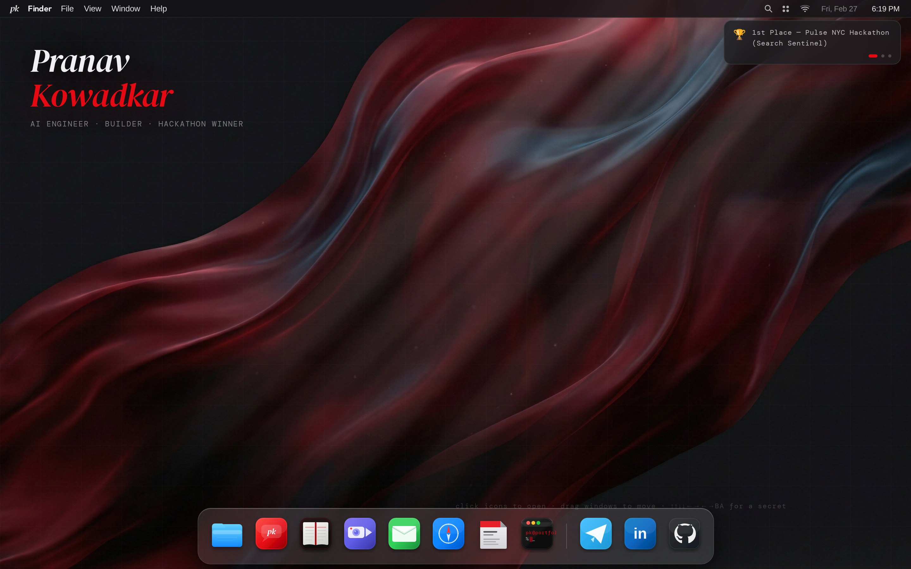
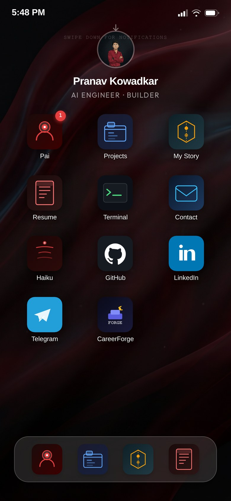

# macOS Portfolio — Template / Skeleton

> **An interactive portfolio designed as a fully functional operating system experience.** Desktop visitors get a macOS-inspired environment; mobile visitors get an iOS springboard. Both share the same underlying data and AI backbone.

This is the **public template** of [Pranav Kowadkar's portfolio](https://www.pkowadkar.com). The sensitive stuff — the full life-story narrative fed to the AI Guide (`backend/data/journey.txt`, `resume.txt`) — is stripped to clearly labeled placeholders. Everything else (photos, project pages, contact links, the AI's system prompt) is left as real example content on purpose, so you can see what a finished one actually looks and sounds like before swapping it for your own — see "Fill in your data" below for the full list of what to change.

**Live demo:** [www.pkowadkar.com](https://www.pkowadkar.com)

---

## Screenshots

### Desktop — macOS Experience



*The macOS-style desktop with menu bar, draggable windows, animated wallpaper, and an auto-hiding dock.*

### Mobile — iOS Springboard Experience



*The iOS-style springboard with live status bar, app icon grid, frosted glass dock, and pull-down notification center.*

---

## Overview

This portfolio is not a traditional scrolling webpage. It is a **dual-mode interactive experience** that detects the visitor's device and renders an entirely different shell:

- **Desktop / Tablet (≥ 768px + no touch):** A macOS-inspired environment with a menu bar, draggable and resizable windows, an auto-hiding dock, animated wallpaper, and a boot sequence with audio.
- **Mobile (< 768px or touch device):** An iOS-style springboard with a live status bar, app icon grid, frosted glass bottom dock, swipe-down notification center, idle lock screen, and PWA support for "Add to Home Screen."

Both modes share the same AI assistant (AIssistant), project data, and narrative content.

---

## Features

### Desktop Shell

| Feature | Description |
|---|---|
| **Boot Intro** | Click-to-enter gate with `pk` monogram (edit for your initials), boot sound (user-gesture triggered), and dissolve animation |
| **macOS Menu Bar** | Live clock, wallpaper switcher, notification ticker for achievements |
| **Draggable Windows** | All apps open as resizable, draggable macOS-style windows via `react-rnd` |
| **Auto-hiding Dock** | Magnification effect on hover, opens apps on click |
| **Animated Wallpaper** | Cinematic dark red/maroon fluid wallpaper, switchable via menu bar |
| **Haiku Easter Egg** | Konami code or triple-click triggers AI-generated haiku poetry |

### Mobile Shell

| Feature | Description |
|---|---|
| **iOS Intro** | Short `pk` flash (edit for your initials) (~1.5s) then springboard |
| **Live Status Bar** | Real-time clock updates every 10 seconds |
| **Springboard Grid** | 3-column app icon grid with labels and animated tap feedback |
| **Frosted Glass Dock** | 4 pinned apps in a bottom dock pill |
| **Pull-down Notification Center** | Swipe down from status bar to reveal 3 achievement notification cards |
| **Idle Lock Screen** | After 60 seconds of inactivity: blurred wallpaper, large clock, tap-to-unlock |
| **Swipe Hint** | Animated down-arrow fades after 4 seconds to teach new visitors |
| **PWA Support** | `manifest.json` + `apple-touch-icon` for "Add to Home Screen" on iPhone |

### Apps (available on both desktop and mobile)

| App | Description |
|---|---|
| **AI Guide (AIssistant)** | AI assistant powered by OpenRouter + RAG backend. Knows your full background, projects, and story via `identity.md` + `journey.txt` + `resume.txt`. Suggested question chips on first open. Requires the backend — `ChatPKApp.tsx`/`MobileAIssistant.tsx` have no client-side fallback by design (see the comment at the top of either file); the actual persona/prompt lives in `backend/main.py`'s `AI_GUIDE_SYSTEM_PROMPT`. Can open Canvas/Scheduler/other apps mid-conversation — see **Tool-calling** below. |
| **Digital Twin (Talk to PK)** | FaceTime-style video call: voice input (Web Speech API) → `/api/chat` (first-person persona) → ElevenLabs TTS in your cloned voice → Simli real-time talking-head avatar lip-syncing over your portrait. Live captions + on-demand transcript. Works as voice-only (no avatar) if Simli isn't configured. Setup: `ELEVENLABS_API_KEY`/`ELEVENLABS_VOICE_ID` + `SIMLI_API_KEY`/`SIMLI_FACE_ID` in `backend/.env` — see `backend.env.example` for the full walkthrough (voice cloning, avatar creation, timing/cost notes). An optional Supabase-backed rate gate keeps a runaway bill from a public link — see the same file. Same tool-calling as AIssistant — mid-call it can pull up a project's Canvas or open the Scheduler without breaking character. |
| **Canvas** | Opens a project's architecture diagram (animated SVG — nodes type in, edges draw after) in its own window. No manual entry point — it only opens via a tool call from AIssistant or the Digital Twin (ask "how does CareerForge work?" or similar). Diagram data lives on each project's `arch` field in `client/src/data/projects.ts`; projects without one get a graceful "not authored yet" placeholder. |
| **Scheduler** | Embeds your Cal.com public profile page (or any embeddable scheduling page) so a visitor can book time with you. Same as Canvas — tool-call-only, no dock/menu entry. Set your URL in `client/src/components/SchedulerContent.tsx`. |
| **Projects** | Interactive project browser with tech stack badges, GitHub links, and live demo links. Data in `client/src/data/projects.ts`. |
| **My Story** | Chapter-based visual timeline. Replace chapter content in `MyStoryApp.tsx`. |
| **Resume / CV** | Inline resume viewer with PDF download. Replace the PDF in `client/public/data/` and update `CVApp.tsx`. |
| **Terminal** | Easter egg terminal with `help`, `whoami`, `projects`, `contact`, and `secret` commands. Update responses in `TerminalApp.tsx`. |
| **Contact** | Message form (desktop, `MessagesApp.tsx`) posts to `/api/contact` → Gmail SMTP. Mobile's `MobileContact.tsx` is a static iOS Contacts-style card with mailto/social links instead — update both. |
| **Haiku** | AI-generated haiku poetry with swipe gestures (mobile) or Konami code (desktop). |
| **Browser / External app** | External link app — point it at your own product/project URL. |

### Tool-calling

AIssistant and the Digital Twin can both open Canvas, Scheduler, or another app window mid-conversation, via real OpenRouter/OpenAI-style function-calling (`TOOLS` in `backend/main.py` — not a prompt convention, the model actually emits a structured call). Desktop routes it through `WindowActionsContext`/`WindowParamsContext` (any app can call `useOpenWindow()`); mobile routes it through a one-level overlay stack in `MobileShell.tsx` so a tool call during a Digital Twin call opens on top of it without hanging up. The dispatch logic itself (`client/src/lib/toolDispatch.ts`) is shared by all four chat surfaces.

The `open_canvas` tool's project list (`PROJECT_REGISTRY` in `backend/main.py`) is a **manually-kept-in-sync duplicate** of `client/src/data/projects.ts` — there's no shared source of truth between Python and TypeScript, so update both when you add, rename, or remove a project.

---

## Tech Stack

### Frontend

| Technology | Purpose |
|---|---|
| **React 19** | UI framework |
| **TypeScript** | Type safety |
| **Vite** | Build tool and dev server |
| **Tailwind CSS v4** | Utility-first styling |
| **shadcn/ui** | Accessible component primitives |
| **Framer Motion** | Animations and transitions |
| **react-rnd** | Draggable/resizable desktop windows |
| **Wouter** | Lightweight client-side routing |
| **Lucide React** | Icon library |
| **simli-client** | WebRTC client for the Digital Twin's talking-head avatar (optional — call still works voice-only without it) |

### Backend (separate Render service)

| Technology | Purpose |
|---|---|
| **Python / FastAPI** | REST API server |
| **OpenRouter** | Multi-model LLM fallback chain (Gemini, Claude, GPT-4.1, Qwen, Mistral) |
| **RAG pipeline** | Your resume + journey as context (`backend/data/`) |
| **ElevenLabs** | Digital Twin voice (TTS from a cloned voice) |
| **Simli** | Digital Twin real-time avatar (optional) |
| **Supabase** | Optional Digital Twin call-rate gate (daily/monthly limits) — fails open (unlimited calls) if not configured |
| **CORS** | Update allowed origins via `ALLOWED_ORIGINS` env var to match your domain |

### Infrastructure

| Service | Purpose |
|---|---|
| **Vercel** | Frontend hosting and CDN |
| **Render** | Backend API hosting |
| **Your preferred registrar** | Domain registration (IONOS, Namecheap, Google Domains, etc.) |
| **UptimeRobot** | Keep-alive pings to Render (prevents cold starts) |
| **GitHub** | Source control, triggers Vercel deploys on push |

---

## Project Structure

```
portfolio-template/
├── client/
│   ├── public/
│   │   ├── manifest.json              # PWA manifest
│   │   └── favicon.svg
│   └── src/
│       ├── components/
│       │   ├── apps/                  # Desktop app windows
│       │   │   ├── ChatPKApp.tsx      # AIssistant AI chat (desktop)
│       │   │   ├── VideoCallApp.tsx   # Digital Twin "Talk to PK" (desktop)
│       │   │   ├── ProjectsApp.tsx
│       │   │   ├── MyStoryApp.tsx
│       │   │   ├── CVApp.tsx
│       │   │   ├── TerminalApp.tsx
│       │   │   ├── MessagesApp.tsx    # Contact form (desktop)
│       │   │   ├── CanvasApp.tsx      # Project architecture viewer (desktop, tool-call only)
│       │   │   └── SchedulerApp.tsx   # Cal.com embed (desktop, tool-call only)
│       │   ├── mobile/                # iOS mobile shell
│       │   │   ├── MobileShell.tsx
│       │   │   ├── MobileIntro.tsx
│       │   │   ├── LockScreen.tsx
│       │   │   ├── NotificationCenter.tsx
│       │   │   └── apps/              # Mobile app screens
│       │   │       ├── MobileAIssistant.tsx
│       │   │       ├── MobileDigitalTwin.tsx  # Digital Twin (mobile)
│       │   │       ├── MobileProjects.tsx
│       │   │       ├── MobileMyStory.tsx
│       │   │       ├── MobileResume.tsx
│       │   │       ├── MobileTerminal.tsx
│       │   │       ├── MobileContact.tsx      # Static contact card (mobile)
│       │   │       ├── MobileHaiku.tsx
│       │   │       ├── MobileCanvas.tsx       # Project architecture viewer (mobile, tool-call only)
│       │   │       └── MobileScheduler.tsx    # Cal.com embed (mobile, tool-call only)
│       │   ├── Desktop.tsx            # macOS desktop shell
│       │   ├── MenuBar.tsx            # macOS menu bar
│       │   ├── Dock.tsx               # macOS dock
│       │   ├── IntroScreen.tsx        # Boot animation
│       │   ├── ArchDiagram.tsx        # Shared animated SVG diagram (Projects + Canvas)
│       │   ├── CanvasContent.tsx      # Shared Canvas content (desktop + mobile wrap this)
│       │   ├── SchedulerContent.tsx   # Shared Scheduler content (desktop + mobile wrap this)
│       │   └── HaikuEasterEgg.tsx
│       ├── contexts/
│       │   ├── WindowActionsContext.tsx  # Desktop: lets any app call openWindow (tool-calling)
│       │   └── WindowParamsContext.tsx   # Desktop: lets any app read its own window's params
│       ├── data/
│       │   ├── projects.ts            # Shared project data (+ optional arch diagram per project)
│       │   ├── experience.ts          # Work history (git-graph timeline)
│       │   └── education.ts           # Education history
│       ├── hooks/
│       │   ├── useMobile.tsx          # Device detection hook
│       │   ├── useSimliAvatar.ts      # Digital Twin: Simli WebRTC avatar
│       │   └── useCaptions.ts         # Digital Twin: live caption pacing
│       ├── lib/
│       │   ├── callAudio.ts           # Digital Twin: TTS playback (backend + browser fallback)
│       │   ├── callGate.ts            # Digital Twin: client half of the optional rate gate
│       │   ├── identity.ts            # Digital Twin: visitor/session id helpers
│       │   └── toolDispatch.ts        # Shared tool_call -> window-open dispatch (all 4 chat surfaces)
│       └── App.tsx                    # Root: device detection + routing
├── backend/                           # Python FastAPI RAG backend
│   ├── data/
│   │   ├── identity.md                # Present-tense "who I am now" — read first (replace this)
│   │   ├── journey.txt                # Your story (replace this)
│   │   └── resume.txt                 # Your resume in plain text (replace this)
│   ├── scripts/
│   │   └── supabase_call_sessions.sql # Optional: Digital Twin call-rate gate schema
│   ├── main.py
│   ├── requirements.txt
│   ├── render.yaml
│   └── backend.env.example            # All required backend env vars
├── scripts/
│   └── fix-simli-client-casing.mjs    # postinstall fix for a simli-client packaging bug
├── frontend.env.example               # All required frontend env vars
└── README.md
```

---

## Getting Started (fork this)

### Step 1 — Clone and install

```bash
git clone https://github.com/p-kowadkar/portfolio-template.git
cd portfolio-template
pnpm install
```

### Step 2 — Fill in your data (the only files you NEED to edit)

| File | What to do |
|---|---|
| `backend/data/identity.md` | Replace with a short, present-tense "who I am right now" — read first on every chat request, ahead of journey.txt/resume.txt. Cheap to keep current. |
| `backend/data/journey.txt` | Replace with your story — written in first person, narrative style. This feeds the RAG backend. |
| `backend/data/resume.txt` | Paste your resume in plain text. Sections: SUMMARY, SKILLS, EXPERIENCE, PROJECTS, ACHIEVEMENTS. |
| `backend/main.py` — `AI_GUIDE_SYSTEM_PROMPT` | Third-person persona for the AI Guide (AIssistant). Update the identity/contact/rules — see the comment style already in the file. |
| `backend/main.py` — `PROJECT_REGISTRY` / `TOOLS` | Update the project id/tagline list to match `projects.ts` — this is what lets AIssistant/the Twin open the right project's Canvas. Also update the `open_app` tool's enum if you rename/remove any window ids. |
| `client/src/data/projects.ts` | Replace with your own projects. Add an `arch` block (nodes/edges — see the CareerForge reference example) to any project you want a Canvas diagram for; it's optional per project. |
| `client/src/data/experience.ts` | Replace with your own work history. |
| `client/src/data/education.ts` | Replace with your own education history. |
| `client/src/components/apps/MyStoryApp.tsx` | Replace chapter content with your own narrative. |
| `client/public/data/` | Drop in your own images and resume PDF. Update references in `CVApp.tsx` and `experience.ts`. |
| `client/src/components/SchedulerContent.tsx` | Set `CAL_COM_URL` to your own scheduling page. |
| `backend/main.py` — `DIGITAL_TWIN_PROMPT` | First-person persona for the "Talk to PK" call. Separate from `AI_GUIDE_SYSTEM_PROMPT`, doesn't share state with it — update both when you change your identity/contact info. |
| `client/src/components/apps/VideoCallApp.tsx` + `mobile/apps/MobileDigitalTwin.tsx` | Set `ANIME_PORTRAIT` to your own reference photo and update the greeting line — see the setup comment at the top of `VideoCallApp.tsx`. Keep both files in sync. |

> **Backend env vars:** See `backend.env.example` for all required variables (OpenRouter key, SMTP credentials, GitHub PAT, ElevenLabs/Simli keys for the Digital Twin, optional Supabase call-rate gate, etc.) — set these on Render under Environment.

### Step 3 — Configure frontend environment variables

Create a `.env` file in the project root:

```env
# Backend API URL (your Render service URL after deploying backend/)
VITE_API_URL=https://YOUR_BACKEND.onrender.com
```

That's the only frontend env var. ElevenLabs and Simli keys for the Digital Twin live in `backend/.env` only — they stay server-side, never in the client bundle. See `backend.env.example` for those.

### Step 4 — Run locally

```bash
pnpm dev
```

The app will be available at `http://localhost:3000`.

### Step 5 — Deploy

| Service | What to deploy | Notes |
|---|---|---|
| **Vercel** | Frontend (`client/`) | Connect your GitHub repo, auto-deploys on push |
| **Render** | Backend (`backend/`) | Uses `backend/render.yaml` for config; set all env vars from `backend.env.example` |
| **UptimeRobot** | Ping your Render URL every 5 min | Prevents Render free-tier cold starts |

### Backend (local)

```bash
cd backend
pip install -r requirements.txt
uvicorn main:app --reload
```

---

## Design Philosophy

The portfolio is built around a single concept: **what if a portfolio felt like an operating system?** Rather than scrolling through sections, visitors explore apps. Rather than reading a bio, they talk to an AI. Rather than viewing a project list, they browse a window.

The visual language is deliberately cinematic — deep maroon and black, serif typography (*DM Serif Display*), monospace accents (*DM Mono*), and fluid animated wallpapers. The aesthetic references classic macOS and iOS design while maintaining a distinctly personal identity through the `pk` monogram and the red accent color.

---

## Easter Eggs

- **Konami Code** on desktop (↑↑↓↓←→←→BA) triggers the haiku viewer
- **Triple-click** anywhere on the desktop also triggers haiku
- **Terminal app** — type `secret` for a hidden message
- **Menu bar** — click the trophy icon in the notification ticker for achievement details
- **Mobile lock screen** — appears after 60 seconds of idle

---

## Acknowledgements

Built with [React](https://react.dev), [Vite](https://vitejs.dev), [Tailwind CSS](https://tailwindcss.com), [shadcn/ui](https://ui.shadcn.com), [Framer Motion](https://www.framer.com/motion/), and [OpenRouter](https://openrouter.ai). Hosted on [Vercel](https://vercel.com) and [Render](https://render.com).

---

*Original design & implementation by [Pranav Kowadkar](https://www.pkowadkar.com). Template released for public use — attribution appreciated but not required.*